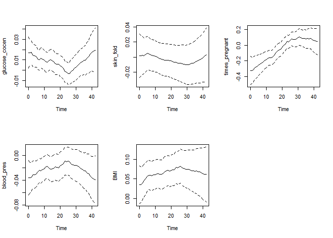
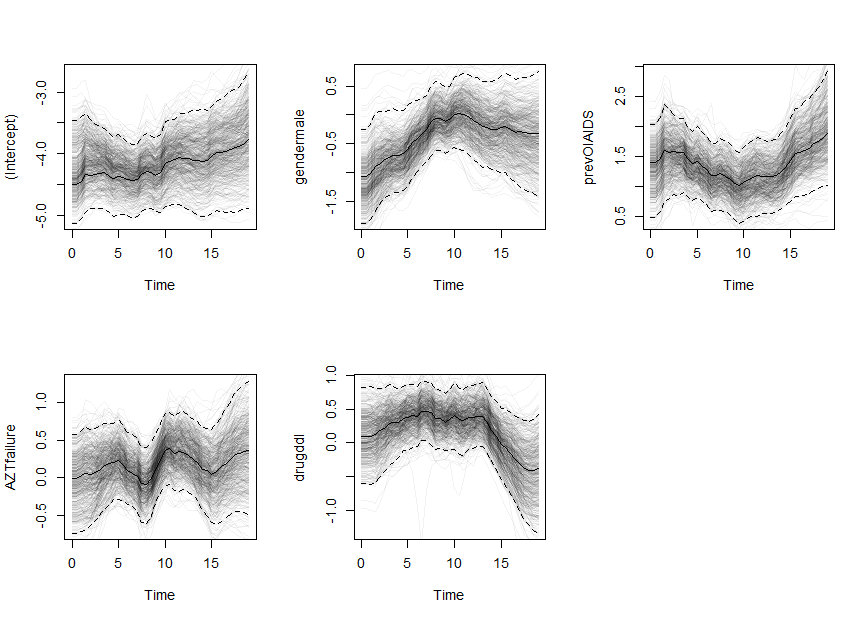
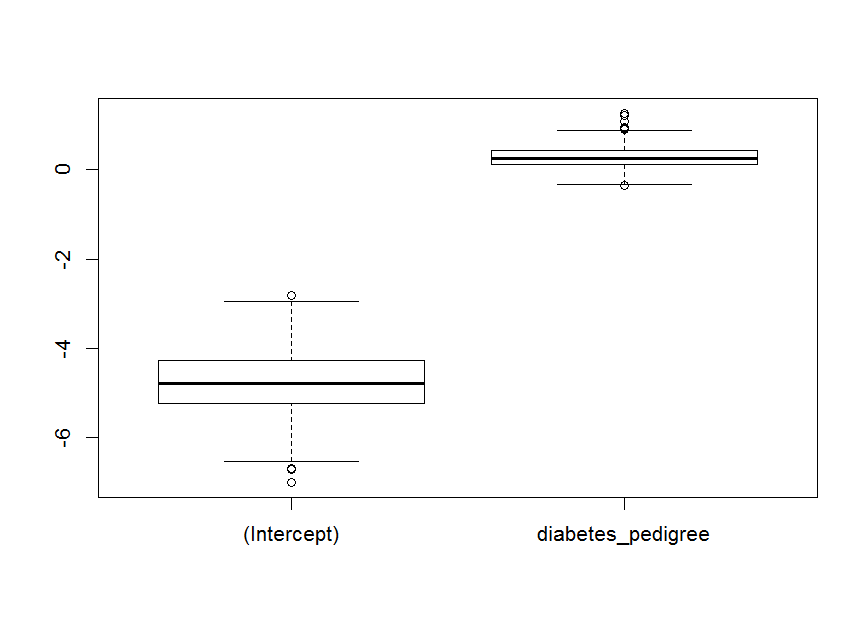

[](https://travis-ci.org/boennecd/dynamichazard)

dynamichazard
=============

The goal of dynamichazard is to estimate binary regression models with time-varying effects. The time-varying effects are estimated with state space models where the coefficients follow a given order random walk. The advantageous of using state space models is that you can extrapolate beyond the last observed time period

The estimation methods are implemented such:

-   They have linear time complexity in both time and the number of observations
-   Computation is done in `c++` with the `Armadillo` library. Consequently, they are fast and computation time can be reduced further with an optimized BLAS and LAPACK library
-   Use a `coxph` like formula from the survival package. Therefore, the methods are easily applied to panel datasets
-   Allows for time-varying covariates

For more details, see the ddhazard vignette at <https://cran.r-project.org/web/packages/dynamichazard/vignettes/ddhazard.pdf>

Installation
------------

You can install dynamichazard from github with:

``` r
install.packages("devtools")
devtools::install_github("dynamichazard/boennecd")
```

You can also download the package from CRAN by calling:

``` r
installed.packages("dynamichazard")
```

Example
-------

We will use the Pima Indians Diabetes dataset from <https://archive.ics.uci.edu/ml/machine-learning-databases/pima-indians-diabetes/>. The outcome in the data set is whether or not the female is having diabetes. The script and results are given below with comments. The data cleaning is included for completeness

``` r
# We download the data
diabetes <-
  read.table("https://archive.ics.uci.edu/ml/machine-learning-databases/pima-indians-diabetes/pima-indians-diabetes.data",
             sep = ",")
colnames(diabetes) <-
  c("times_pregnant", "glucose_cocen", "blood_pres", "skin_fold",
    "insulin", "BMI", "diabetes_pedigree", "age", "has_diabetes")

head(diabetes)
#>   times_pregnant glucose_cocen blood_pres skin_fold insulin  BMI
#> 1              6           148         72        35       0 33.6
#> 2              1            85         66        29       0 26.6
#> 3              8           183         64         0       0 23.3
#> 4              1            89         66        23      94 28.1
#> 5              0           137         40        35     168 43.1
#> 6              5           116         74         0       0 25.6
#>   diabetes_pedigree age has_diabetes
#> 1             0.627  50            1
#> 2             0.351  31            0
#> 3             0.672  32            1
#> 4             0.167  21            0
#> 5             2.288  33            1
#> 6             0.201  30            0
nrow(diabetes) # Number of samples before cleaning
#> [1] 768

# Remove observations with invalid values
diabetes <- diabetes[diabetes$BMI > 0, ]
diabetes <- diabetes[diabetes$blood_pres > 0, ]
diabetes <- diabetes[diabetes$skin_fold > 0, ]

nrow(diabetes) # Number of samples after cleaning
#> [1] 537

# We load the two libraries we will need
library(survival); library(dynamichazard)
min(diabetes$age)                             # Youngest person in study
#> [1] 21
max(diabetes$age)                             # Oldest person in study
#> [1] 81
max(diabetes$age[diabetes$has_diabetes == 1]) # Last person with diabetes
#> [1] 70

# Notice that we have few cases and controls in the end as illustrated below
diabetes$t <- diabetes$age - min(diabetes$age) + 1 # Time scale in study
xtabs(~ has_diabetes + t, diabetes)
#>             t
#> has_diabetes  1  2  3  4  5  6  7  8  9 10 11 12 13 14 15 16 17 18 19 20
#>            0 45 53 28 33 25 20 15 21  8 10  6  5  5  7  3  4  8  4  8  4
#>            1  4  7  4  7 12  6  5  7 10  4  8  5  7  2  4  7  4  6  1  5
#>             t
#> has_diabetes 21 22 23 24 25 26 27 28 29 30 31 32 33 34 35 36 37 38 39 40
#>            0  5  8  2  0  4  4  1  3  2  1  1  0  0  0  1  1  1  1  1  3
#>            1  7  3  9  1  5  6  2  1  2  3  5  4  3  2  1  2  1  3  1  1
#>             t
#> has_diabetes 41 42 43 45 50 61
#>            0  1  1  3  1  0  1
#>            1  0  1  0  0  1  0

# Thus, we set the last time (max_T) slighly lower later
# Fit the model
fit <- ddhazard(
  Surv(t, has_diabetes) ~
    ddFixed(1) +                        # These effects are time invariant
    ddFixed(diabetes_pedigree) +
    glucose_cocen + blood_pres +        # The rest are time-varying
    skin_fold + BMI + times_pregnant
    ,
  data = diabetes,
  by = 1,                               # time interval lengths
  max_T = 42,                           # last period observed while estimating 
  Q_0 = diag(1e5, 5), Q = diag(1e-4, 5) # Covariances mats for state equation
  )
#> a_0 not supplied. One iteration IWLS of static glm model is used

# Plot the effects estimates with 95% point-wise confidence bounds
plot(fit)
```



``` r

# Print time-invariant estimates
fit$fixed_effects
#>       (Intercept) diabetes_pedigree 
#>        -4.6035970         0.2231969

# Bootstrap the estimates
boot_out <- ddhazard_boot(fit, R = 1000) # R is number of bootstrap samples
#> Warning in ddhazard_boot(fit, R = 1000): Failed to estimate 262 times

# Plot bootstrapped estimates (transparent lines) and 2.5% and 97.5% quantiles
# (dashed-lines)
plot(fit, ddhazard_boot = boot_out)
#> Only plotting 500 of the boot sample estimates
```



``` r

# Make boxplot for the bootstrap estimate of the fixed effect
boxplot(t(tail(t(boot_out$t), 2)))
```



The above is only correct if those who are diagnosed with diabetes did not have the disease shortly prior to diagnosis. This is the case since a person who gets diagnosed at say *t* = 40 is modeled as not having diabetes at *t* = 0, 1, ..., 39 with the same covariates. This further stress that all other covariates are kept fixed such as `BMI` which could change through time. For instance, this may explain the effect `times_pregnant`. You would not expect many women at age 21 (*t* = 1) to have say 11 children
