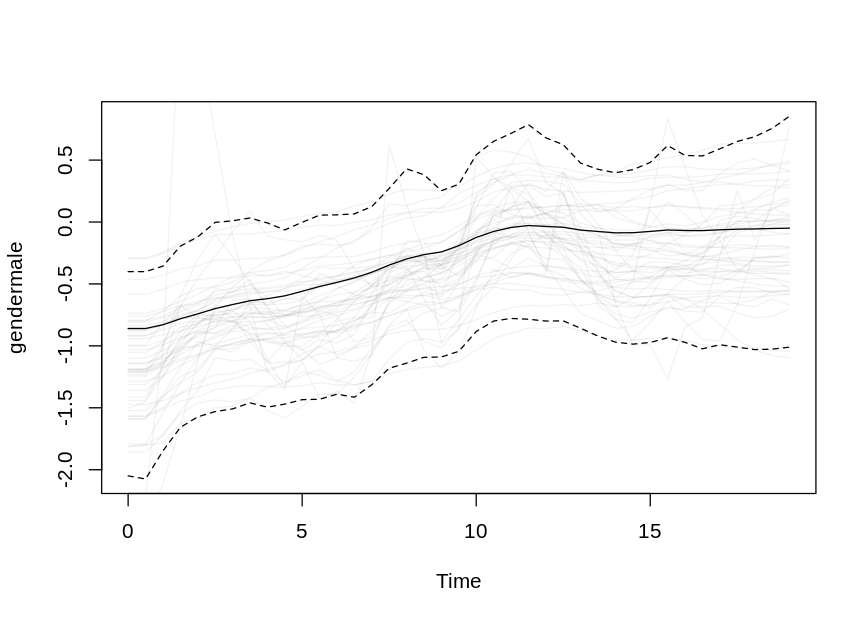
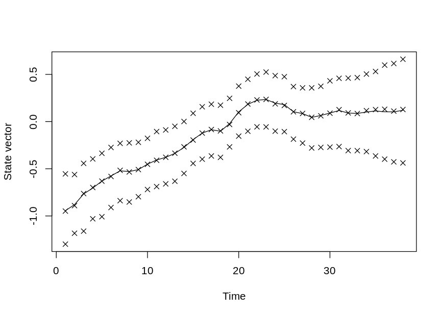
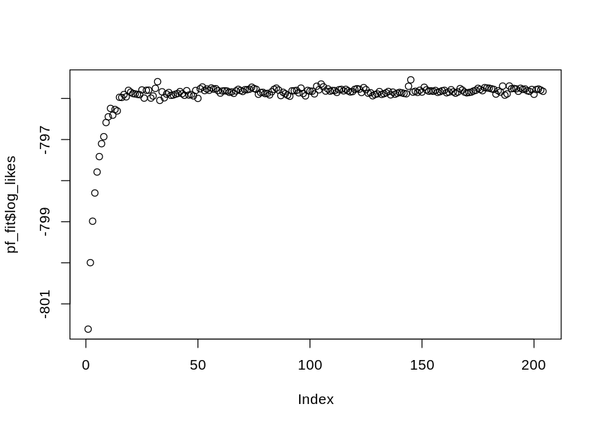

dynamichazard
=============

[](https://github.com/boennecd/dynamichazard/actions)
[](https://www.r-pkg.org/badges/version/dynamichazard)  
[](http://cran.rstudio.com/web/packages/dynamichazard/index.html)

The goal of dynamichazard is to estimate time-varying effects in
survival analysis. The time-varying effects are estimated with state
space models where the coefficients follow a given order random walk.
The advantageous of using state space models is that you can extrapolate
beyond the last observed time period. For more details, see the ddhazard
vignette at
<a href="https://cran.r-project.org/web/packages/dynamichazard/vignettes/ddhazard.pdf" class="uri">https://cran.r-project.org/web/packages/dynamichazard/vignettes/ddhazard.pdf</a>.

The particle filter and smoother methods can estimate more general
models then the random walk model. See the [/examples](/examples)
directory for some examples.

Installation
------------

You can install dynamichazard from github with:

``` r
# install.packages("devtools")
devtools::install_github("boennecd/dynamichazard")
```

You can also download the package from CRAN by calling:

``` r
install.packages("dynamichazard")
```

Example - ddhazard
------------------

I will use the `aids` data set from the `JMbayes` package. The data set
is from a a randomized clinical trial between two drugs for HIV or aids
patients. The event is when the patient die. Patient are right censored
at the end of the study. The data set is longitudinal/panel format with
rows for patient. Though, the only longitudinal variable is the `CD4`
count (T-cells count) which is presumably affected by the drug. Thus, I
will not use it in the model. The other the other columns of interest
are:

-   `AZT` is one of the two enrollment criteria. It indicates whether
    the patient was enrolled due to intolerance to the drug zidovudine
    or whether the drug failed prior to the study start.
-   `prevOI` is the other enrollment criteria. Patients are enrolled
    either due AIDS diagnosis or two CD4 counts of 300 or fewer. The
    variable indicates which is the case.
-   `drug` is either `ddC` or `ddI` depending on which of the two drugs
    the patient is randomly assigned to.
-   `gender`.

The analysis is given below with comments:

``` r
library(dynamichazard)
#> Loading required package: survival
library(JMbayes) # Contain the aids data set
#> Loading required package: nlme
#> Loading required package: doParallel
#> Loading required package: foreach
#> Loading required package: iterators
#> Loading required package: parallel
#> Loading required package: rstan
#> Loading required package: StanHeaders
#> Loading required package: ggplot2
#> rstan (Version 2.21.2, GitRev: 2e1f913d3ca3)
#> For execution on a local, multicore CPU with excess RAM we recommend calling
#> options(mc.cores = parallel::detectCores()).
#> To avoid recompilation of unchanged Stan programs, we recommend calling
#> rstan_options(auto_write = TRUE)

# We remove the data we dont neeed
aids <- aids[aids$Time == aids$stop, ]
aids <- aids[, !colnames(aids) %in% c("Time", "death", "obstime", "CD4")]

# A look at head of data
head(aids)
#>    patient drug gender prevOI         AZT start  stop event
#> 3        1  ddC   male   AIDS intolerance    12 16.97     0
#> 7        2  ddI   male noAIDS intolerance    18 19.00     0
#> 10       3  ddI female   AIDS intolerance     6 18.53     1
#> 14       4  ddC   male   AIDS     failure    12 12.70     0
#> 18       5  ddI   male   AIDS     failure    12 15.13     0
#> 19       6  ddC female   AIDS     failure     0  1.90     1
max(aids$stop)                  # Last observation time
#> [1] 21.4
max(aids$stop[aids$event == 1]) # Last person with event
#> [1] 19.07

# Fit model with extended Kalman filter
fit <- ddhazard(
  Surv(stop, event) ~ ddFixed_intercept() + ddFixed(AZT) + gender + 
    ddFixed(drug) + ddFixed(prevOI),
  aids,
  model = "exponential",          # piecewise constant exponentially distributed 
                                  # arrivals times
  by = .5,                        # Length of time intervals in state space 
                                  # model
  max_T = 19,                     # Last period we observe when modeling
  Q = .1^2,                       # Covariance matrix for state equation in 
                                  # first iteration
  Q_0 = 1,                        # Covariance matrix for the prior
  control = ddhazard_control(
    eps = .001,                   # tolerance for EM-algorithm
    LR = .9,                      # Learning rate
    n_max = 100                   # Max number iterations in EM
    ))
#> a_0 not supplied. IWLS estimates of static glm model is used for random walk models. Otherwise the values are zero

# Plot the estimates. Dashed lines are 95% confidence bounds
plot(fit)
```


``` r

# Bootstrap the estimates
set.seed(87754771)
boot_out <- ddhazard_boot(fit, R = 1000) # R is number of bootstrap samples

# Plot bootstrap estimates. Dashed lines are 2.5% and 97.5% quantiles of the 
# bootstrap estimates. Transparent lines are bootstrap estimates
plot(fit, ddhazard_boot = boot_out)
#> Only plotting 50 of the boot sample estimates
```



Bootstrapping only slightly changes the confidence bounds. An example of
a paper analyzing the CD4 count can be found in Guo & Carlin (2004).
They also fit a static model (time-invariant coefficients) of the
survival times with an exponential model. The estimates are comparable
with those above as expected.

Example - particle filter and smoother
--------------------------------------

A particle filter and smoother is also included in the package. The
computational complexity of these methods match those of the extended
Kalman filter but with a much larger constant. Below, I fit a model for
the `aids` data. We only use a time-varying effect for gender this time.

<!-- 
  knitr::opts_knit$set(output.dir = ".")
  knitr::load_cache("pf_fit", path = "README_cache/markdown_github/") 
-->

``` r
set.seed(20170907)
pf_fit <- PF_EM(
  Surv(stop, event) ~ ddFixed_intercept() + ddFixed(AZT) + gender + 
    ddFixed(drug) + ddFixed(prevOI),
  aids, model = "exponential",
  by = .5,  max_T = 19, Q = .5^2, Q_0 = 1,
  control = PF_control(
    n_threads = 4, # I use a quad-core machine
    # set number of particles
    N_fw_n_bw = 1000, N_first = 1000,
    N_smooth = 1, # Does not matter with Brier_O_N_square
    smoother = "Brier_O_N_square", # Select smoother
    eps = 1e-5, n_max = 1000, est_a_0 = FALSE, nu = 6L, 
    covar_fac = 1.2, averaging_start = 150L)
  #, trace = 1 # comment back to get feedback during estimation
  )
#> a_0 not supplied. IWLS estimates of static glm model is used for random walk models. Otherwise the values are zero
```

``` r
# Compare estimates of Q
pf_fit$Q / .5
#>            gendermale
#> gendermale 0.04215704
fit$Q
#>            gendermale
#> gendermale 0.01648568
plot(pf_fit)
```



``` r
plot(pf_fit$log_likes) # log-likelihoods
```



``` r
logLik(pf_fit)
#> 'log Lik.' -795.8261 (df=5)
```

``` r
# better estimate of final log-likelihood
logLik(PF_forward_filter(pf_fit, N_fw = 10000, N_first = 10000))
#> 'log Lik.' -795.9264 (df=NA)
```

For more details, see the “Particle filters in the dynamichazard
package” vignette at
<a href="https://cran.r-project.org/web/packages/dynamichazard/vignettes/Particle_filtering.pdf" class="uri">https://cran.r-project.org/web/packages/dynamichazard/vignettes/Particle_filtering.pdf</a>

References
==========

Guo, X., & Carlin, B. P. (2004). Separate and joint modeling of
longitudinal and event time data using standard computer packages. *The
American Statistician*, *58*(1), 16–24.
