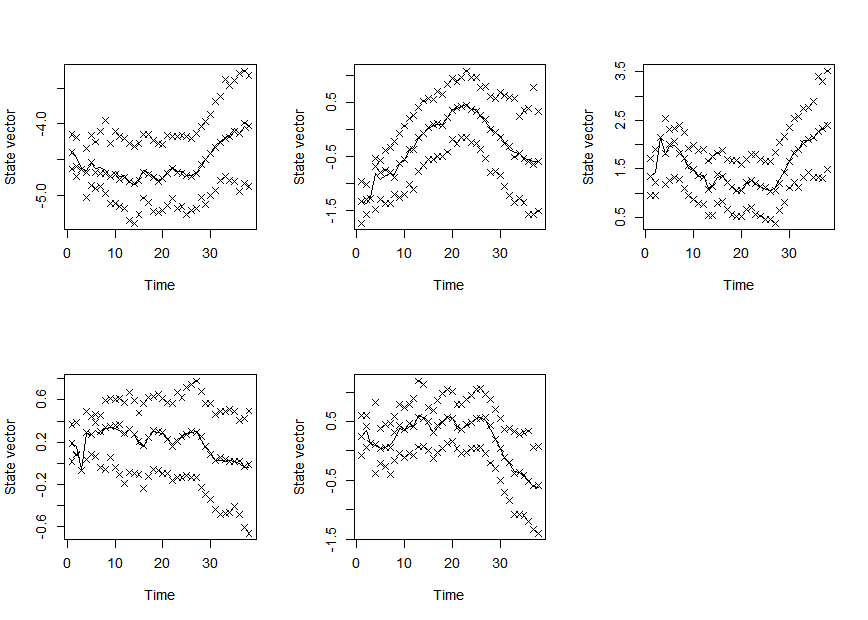

[](https://travis-ci.org/boennecd/dynamichazard)

dynamichazard
=============

The goal of dynamichazard is to estimate time-varying effects in survival analysis. The time-varying effects are estimated with state space models where the coefficients follow a given order random walk. The advantageous of using state space models is that you can extrapolate beyond the last observed time period.

The estimation methods are implemented such:

-   They have linear time complexity in both time and the number of observations.
-   Computation is done in `c++` using `BLAS` and `LAPACK`.
-   Use a `coxph` like formula from the survival package. Therefore, the methods are easily applied to panel datasets.
-   Allows for time-varying covariates.

For more details, see the ddhazard vignette at <https://cran.r-project.org/web/packages/dynamichazard/vignettes/ddhazard.pdf>

Installation
------------

You can install dynamichazard from github with:

``` r
install.packages("devtools")
devtools::install_github("dynamichazard/boennecd")
```

You can also download the package from CRAN by calling:

``` r
installed.packages("dynamichazard")
```

Example - ddhazard
------------------

I will use the `aids` data set from the `JMbayes` package. The data set is from a a randomized clinical trial between two drugs for HIV or aids patients. The event is when the patient die. Patient are right censored at the end of the study. The data set is longitudinal/panel format with rows for patient. Though, the only longitudinal variable is the `CD4` count (T-cells count) which is presumably affected by the drug. Thus, I will not use it in the model. The other the other columns of interest are:

-   `AZT` is one of the two enrolment criteria. It indicates whether the patient was enrolled due to intolerance to the drug zidovudine or whether the drug failed prior to the study start.
-   `prevOI` is the other enrolment criteria. Patients are enrolled either due AIDS diagnosis or two CD4 counts of 300 or fewer. The variable indicates which is the case.
-   `drug` is either `ddC` or `ddI` depending on which of the two drugs the patient is randomly assigned to.
-   `gender`.

The analysis is given below with comments:

``` r
library(dynamichazard)
#> Loading required package: survival
library(survival)
library(JMbayes) # Contain the aids data set
#> Loading required package: MASS
#> Loading required package: nlme
#> Loading required package: splines

# We remove the data we dont neeed
aids <- aids[aids$Time == aids$stop, ]
aids <- aids[, !colnames(aids) %in% c("Time", "death", "obstime", "CD4")]

# A look at head of data
head(aids)
#>    patient drug gender prevOI         AZT start  stop event
#> 3        1  ddC   male   AIDS intolerance    12 16.97     0
#> 7        2  ddI   male noAIDS intolerance    18 19.00     0
#> 10       3  ddI female   AIDS intolerance     6 18.53     1
#> 14       4  ddC   male   AIDS     failure    12 12.70     0
#> 18       5  ddI   male   AIDS     failure    12 15.13     0
#> 19       6  ddC female   AIDS     failure     0  1.90     1
max(aids$stop)                  # Last observation time
#> [1] 21.4
max(aids$stop[aids$event == 1]) # Last person with event
#> [1] 19.07

# Fit model with extended Kalman filter
fit <- ddhazard(
  Surv(stop, event) ~ AZT + gender + drug + prevOI,
  aids,
  model = "exp_clip_time_w_jump", # The model I use from ddhazard. In short, 
                                  # this model assumes that event times are 
                                  # exponentially distributed
  by = .5,                        # Length of time intervals in state space 
                                  # model
  max_T = 19,                     # Last period we observe when modeling
  Q = diag(.1, 5),                # Covariance matrix for state equation in 
                                  # first iteration
  Q_0 = diag(10, 5),              # Covariance matrix for the prior
  control = list(
    eps = .001,                   # tolerance for EM-algorithm
    NR_eps = 1e-5,                # Use more iteration of the EKF
    LR = .5,                      # Learning rate
    n_max = 20                    # Max number iterations in EM
    ))
#> a_0 not supplied. One iteration IWLS of static glm model is used

# Plot the estimates. Dashed lines are 95% confidence bounds
plot(fit)
```


``` r

# Bootstrap the estimates
boot_out <- ddhazard_boot(fit, R = 1000) # R is number of bootstrap samples

# Plot bootstrap estimates. Dashed lines are 2.5% and 97.5% quantiles of the 
# bootstrap estimates. Transparent lines are bootstrap estimates
plot(fit, ddhazard_boot = boot_out)
#> Only plotting 50 of the boot sample estimates
```


Bootstrapping only slightly changes the confidence bounds. It seems that:

-   It is hard to tell the difference between the two drugs. The `ddi` may be more effective in the latter period (the estimates is negative) though the point-wise confidence bounds still contains 0. Further, this comment neglect that the confidence bounds are point-wise.
-   Having aids rather than being enrolled (only) due to two CD4 counts of 300 or fewer is associated with an increased risk of dying.
-   Males seems to be at lower risk in the first period.

An example of a paper analyzing the CD4 count can be found in Guo & Carlin (2004). They also fit a static model (time-invariant coefficients) of the survival times with an exponential model. The estimates are comparable with those above as expected.

Example - particle filter and smoother
--------------------------------------

A particle filter and smoother is also included in the package. The computational complexity of these methods match those of the extended Kalman filter but with a much larger constant. Below, I fit a model for the `aids` data but where we model the outcomes as binary.

``` r
options(ddhazard_max_threads = 7) # I am on a 8 core machine

set.seed(20170907)
pf_fit <- PF_EM(
  Surv(stop, event) ~ AZT + gender + drug + prevOI,
  aids,
  model = "logit", # model binary outcomes
  by = .5,  
  max_T = 19,
  Q = diag(.05, 5),
  Q_0 = diag(1, 5),
  control = list(
    # set number of particles
    N_fw_n_bw = 1000, 
    N_first = 10000,
    N_smooth = 1, # Does not matter with Brier_O_N_square
    
    smoother = "Brier_O_N_square", # Select smoother
    
    eps = .001, 
    n_max = 20
    )
  #, trace = 1 # comment back to get feedback during estimation
  )
#> a_0 not supplied. One iteration IWLS of static glm model is used
#> Warning in .PF_EM(n_fixed_terms_in_state_vec = 0, X = t(X_Y$X), fixed_terms
#> = t(X_Y$fixed_terms), : Method did not converge.

# Compare estimates of Q
pf_fit$Q
#>              [,1]         [,2]         [,3]         [,4]         [,5]
#> [1,]  0.027031377 -0.004636629 -0.013979750 -0.012463987  0.004370164
#> [2,] -0.004636629  0.026500607 -0.003655805  0.008676322 -0.014540987
#> [3,] -0.013979750 -0.003655805  0.048881239  0.007437342 -0.012723799
#> [4,] -0.012463987  0.008676322  0.007437342  0.037928373 -0.025334120
#> [5,]  0.004370164 -0.014540987 -0.012723799 -0.025334120  0.045920919
fit$Q
#>              (Intercept)   AZTfailure   gendermale      drugddI
#> (Intercept)  0.047943451 -0.002276844 -0.017820664 -0.009993567
#> AZTfailure  -0.002276844  0.042550590 -0.004311827  0.001327104
#> gendermale  -0.017820664 -0.004311827  0.057309540  0.001134381
#> drugddI     -0.009993567  0.001327104  0.001134381  0.041761290
#> prevOIAIDS  -0.015794509 -0.012788707 -0.017556331 -0.011020364
#>              prevOIAIDS
#> (Intercept) -0.01579451
#> AZTfailure  -0.01278871
#> gendermale  -0.01755633
#> drugddI     -0.01102036
#> prevOIAIDS   0.05301432

# Look at coefficients. Crosses are 2.5%, 50% and 97.5% quantiles. The curves
# are mean estimates
par(mfcol = c(2, 3))
for(i in 1:5)
  plot(pf_fit, cov_index = i)
```



For more details, see the "Particle filters in the dynamichazard package" vignette at <https://cran.r-project.org/web/packages/dynamichazard/vignettes/Particle_filtering.pdf>

References
==========

Guo, X., & Carlin, B. P. (2004). Separate and joint modeling of longitudinal and event time data using standard computer packages. *The American Statistician*, *58*(1), 16–24.
