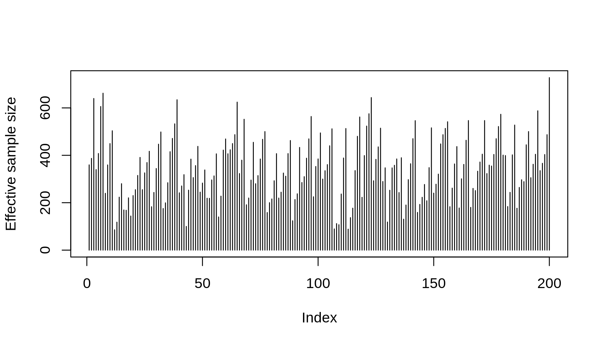
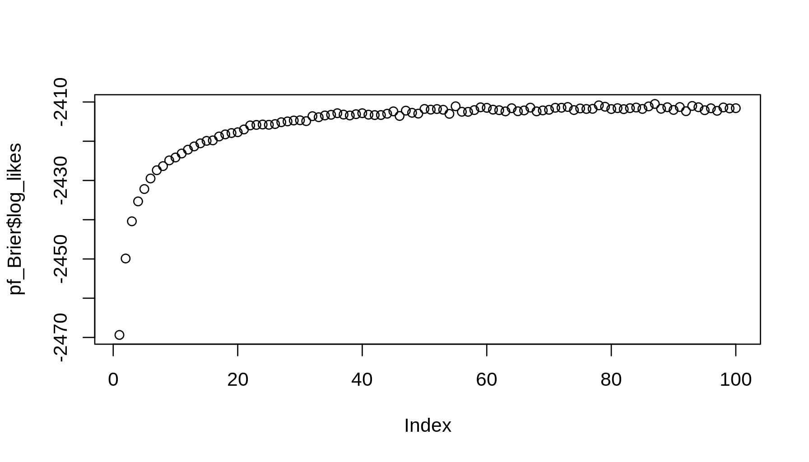
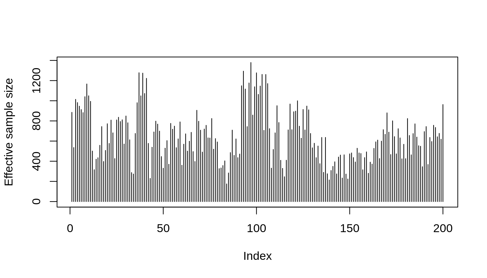
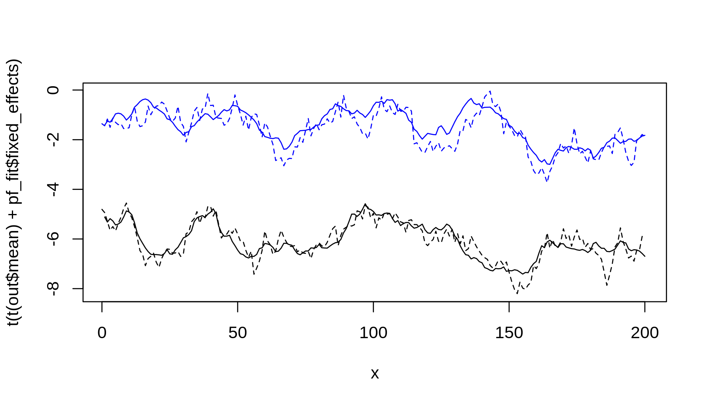
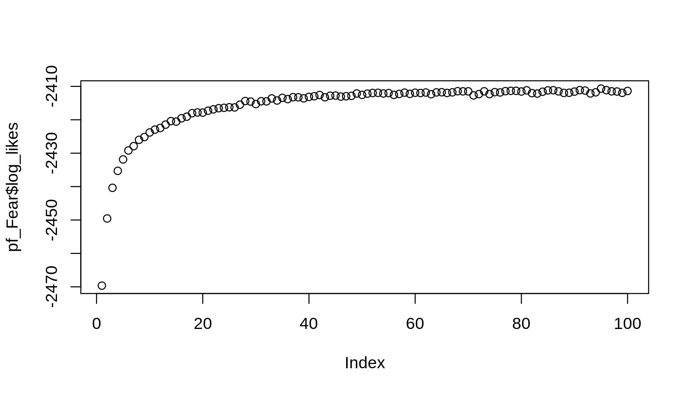
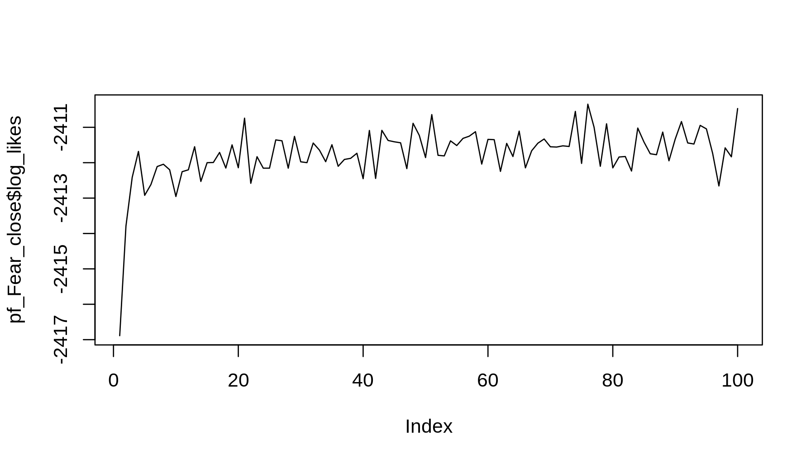

Introduction
------------

We will simulate and estimate a first order vector auto-regression model with the in this example using the particle filter and smoother. For details see [this vignette](../vignettes/Particle_filtering.pdf) which can also be found by calling `vignette("Particle_filtering", package = "dynamichazard")`. The models we are going to simulate from and estimate are of the form

$$
\\begin{split}
    y\_{it} &\\sim g(\\cdot\\vert\\eta\_{it}) &  \\\\
    \\vec{\\eta}\_t &= X\_tR^+\\vec{\\alpha}\_t + Z\_t\\vec{\\beta} +  \\vec{o}\_t \\\\
    \\vec{\\alpha}\_t &= F\\vec{\\alpha}\_{t - 1} + R\\vec{\\epsilon}\_t &
        \\quad \\vec{\\epsilon}\_t \\sim N(\\vec{0}, Q) \\\\
    & & \\quad \\vec{\\alpha}\_0 \\sim N(\\vec{a}\_0, Q\_0)
\\end{split}, \\qquad
\\begin{array}{l} i = 1, \\dots, n\_t \\\\ t = 1, \\dots, d \\end{array}
$$

where the *y*<sub>*i**t*</sub>'s are Poisson distributed event indicators conditional on knowing the log time at risk, $\\vec{o}\_t$, covariates, *X*<sub>*t*</sub> and *Z*<sub>*t*</sub>, and latent states, $\\vec{\\alpha}\_1,\\dots,\\vec{\\alpha}\_d$. The model is a precise-wise constant exponentially distributed event times conditional on knowing the latent states. Further, we set *Z*<sub>*t*</sub> = *X*<sub>*t*</sub> so the states have a non-zero mean. The true values are

$$
F = \\begin{pmatrix}0.9 & 0 \\\\ 0 & 0.9 \\end{pmatrix}, \\quad
Q = \\begin{pmatrix}0.33^2 & 0 \\\\ 0 & 0.33^2 \\end{pmatrix}, \\quad
R = I\_2, \\quad 
\\vec{\\beta} = (-6.5, -2)^\\top
$$

where *I*<sub>2</sub> is the two-dimensional identity matrix and $\\vec{a}\_0$ and *Q*<sub>0</sub> are given by the invariant distribution. The unknown parameters to be estimated is everything but *Q*<sub>0</sub> and *R* (since we fix *Q*<sub>0</sub> doing the estimation and we set $\\vec{a}\_0 = (0, 0)^\\top$). This example is run on the git branch "devel" with key "fa28b3f". The code can be found on [the github site for the package](.). All functions which assignments are not shown and are not in the `dynamichazard` package can be found on the github site.

Simulation
----------

We start by simulating the data. Feel free to skip this part as the specifications are given above. First we assign the parameters for the simulation

``` r
n_obs     <- 1000L
n_periods <- 200L

Fmat <- matrix(c(.9, 0, 0, .9), 2)
Rmat <- diag(1    , 2)
Qmat <- diag(.33^2, 2)
Q_0  <- get_Q_0(Qmat, Fmat)
beta <- c(-6.5, -2)
```

`get_Q_0` is a function to get the covariance matrix for the invariant distribution. We then simulate and plot the latent states

``` r
set.seed(54432125)
betas <- matrix(nrow = n_periods + 1, ncol = 2)
betas[1, ] <- rnorm(2) %*% chol(Q_0)
for(i in 1:n_periods + 1)
  betas[i, ] <- Fmat %*% betas[i - 1, ] + drop(rnorm(2) %*% chol(Qmat))

betas <- t(t(betas) + beta)

# plot of latent variables
cols <- c("black", "darkblue")
matplot(betas, type = "l", lty = 1, col = cols)
for(i in 1:2)
  abline(h = beta[i], lty = 2, col = cols[i])
```


Then we simulate the observations

``` r
df <- replicate(n_obs, {
  # left-censoring
  tstart <- max(0L, sample.int((n_periods - 1L) * 2L, 1) - n_periods + 1L)

  # covariates
  x <- runif(1, -1, 1)
  covars <- c(1, x)

  # outcome (stop time and event indicator)
  y <- FALSE
  for(tstop in (tstart + 1L):n_periods){
    fail_time <- rexp(1) / exp(covars %*% betas[tstop + 1L, ])
    if(fail_time <= 1){
      y <- TRUE
      tstop <- tstop - 1L + fail_time
      break
    }
  }

  c(tstart = tstart, tstop = tstop, x = x, y = y)
})
df <- data.frame(t(df))
head(df, 10)
```

    ##    tstart   tstop        x y
    ## 1       0 200.000  0.12579 0
    ## 2       0   7.576 -0.33636 1
    ## 3      13  98.327 -0.71698 1
    ## 4       0  97.704 -0.23523 1
    ## 5     163 200.000  0.93955 0
    ## 6       0 200.000  0.12357 0
    ## 7      46 200.000 -0.07416 0
    ## 8       0 200.000 -0.18945 0
    ## 9       0  66.009 -0.95364 1
    ## 10      0 174.634 -0.51311 1

We left-censor the observations since we otherwise may end up with a low number of observations towards the end.

### Model without latent variables

We can fit a model without the latent variables (i.e., a constant coefficient model) as follows

``` r
library(survival)
surv_fit <- survreg(Surv(tstop - tstart, y) ~ x, df, dist = "exponential")
summary(surv_fit) # signs are flipped
```

    ## 
    ## Call:
    ## survreg(formula = Surv(tstop - tstart, y) ~ x, data = df, dist = "exponential")
    ##             Value Std. Error    z        p
    ## (Intercept)  5.80     0.0608 95.4 0.00e+00
    ## x            1.47     0.1043 14.1 6.86e-45
    ## 
    ## Scale fixed at 1 
    ## 
    ## Exponential distribution
    ## Loglik(model)= -2426   Loglik(intercept only)= -2539
    ##  Chisq= 225.5 on 1 degrees of freedom, p= 0 
    ## Number of Newton-Raphson Iterations: 5 
    ## n= 1000

``` r
logLik(surv_fit)
```

    ## 'log Lik.' -2426 (df=2)

The signs are flipped as stated in `help("survreg")`. They are though close to $\\vec{\\beta}$ as expected. Further, we can compare the log-likelihood with this models with the log-likelihood approximation we get from the particle filter in the next section.

Particle filter and smoother
----------------------------

We start off by using the generalized two-filter smoother from (Briers, Doucet, and Maskell 2009). We estimate the parameters with an EM algorithm by calling `PF_EM` as follows

``` r
library(dynamichazard)
```

<!-- 
  knitr::opts_knit$set(output.dir = ".")
  knitr::load_cache("brier_far_F", "pf_Brier", path = "examples/cache/firstOrderVAR-cache/") 
-->
``` r
set.seed(30520116)
system.time(pf_Brier <- PF_EM(
  Surv(tstart, tstop, y) ~ x + ddFixed(x) + ddFixed_intercept(TRUE), df,
  Q_0 = diag(1, 2), Q = diag(1, 2), Fmat = matrix(c(.1, 0, 0, .1), 2), 
  by = 1, type = "VAR", model = "exponential", max_T = n_periods,
  control = PF_control(
    N_fw_n_bw = 750, N_smooth = 1, N_first = 2000, eps = .001,
    method = "AUX_normal_approx_w_cloud_mean",
    n_max = 100, smoother = "Brier_O_N_square",
    # we add some extra variation to the proposal distributions
    Q_tilde = diag(.3^2, 2), n_threads = n_threads)))
```

    ## a_0 not supplied. IWLS estimates of static glm model is used for random walk models. Otherwise the values are zero

    ## Warning in .PF_EM(trace = trace, seed = seed, fixed_parems =
    ## fixed_parems, : Method did not converge.

    ##    user  system elapsed 
    ##   15993    2097    5544

`system.time` is used to show the computation time. The estimated parameters are

``` r
pf_Brier$F
```

    ##        [,1]     [,2]
    ## [1,] 0.9201 0.001681
    ## [2,] 0.1585 0.868646

``` r
chol(pf_Brier$Q)
```

    ##       [,1]    [,2]
    ## [1,] 0.248 0.02458
    ## [2,] 0.000 0.44022

``` r
pf_Brier$fixed_effects
```

    ## [1] -6.051 -1.595

The effective sample size in the smoothing step at each time point is

``` r
plot(pf_Brier$effective_sample_size$smoothed_clouds, type = "h", 
     ylim = range(0, pf_Brier$effective_sample_size$smoothed_clouds), 
     ylab = "Effective sample size")
```



The smoothed estimates of the latent states looks as follows (the vertical dashed lines are points where we did not sample well)

``` r
plot_cloud(pf_Brier)
```


The dashed non-vertical lines are the true curve and the continuous is the smoothed estimate. The approximate log-likelihoods from the particle filter at the EM iterations are

``` r
plot(pf_Brier$log_likes)
```



We can compare the output above with the smoother from (Fearnhead, Wyncoll, and Tawn 2010)

<!-- 
  knitr::opts_knit$set(output.dir = ".")
  knitr::load_cache("fear_far_F", "pf_Fear", path = "examples/cache/firstOrderVAR-cache/") 
-->
``` r
set.seed(30520116)
system.time(pf_Fear <- PF_EM(
  Surv(tstart, tstop, y) ~ x + ddFixed(x) + ddFixed_intercept(TRUE), df,
  Q_0 = diag(1, 2), Q = diag(1, 2), Fmat = matrix(c(.1, 0, 0, .1), 2), 
  by = 1, type = "VAR", model = "exponential", max_T = n_periods,
  control = PF_control(
    N_fw_n_bw = 500, N_smooth = 2000, N_first = 2000, eps = .001,
    method = "AUX_normal_approx_w_cloud_mean",
    n_max = 100, smoother = "Fearnhead_O_N",
    Q_tilde = diag(.3^2, 2), n_threads = n_threads)))
```

    ## a_0 not supplied. IWLS estimates of static glm model is used for random walk models. Otherwise the values are zero

    ## Warning in .PF_EM(trace = trace, seed = seed, fixed_parems =
    ## fixed_parems, : Method did not converge.

    ##    user  system elapsed 
    ##   10961    1538    4512

The estimates are similar

``` r
pf_Fear$F
```

    ##        [,1]     [,2]
    ## [1,] 0.9105 0.005276
    ## [2,] 0.1456 0.871594

``` r
chol(pf_Fear$Q)
```

    ##        [,1]    [,2]
    ## [1,] 0.2626 0.03025
    ## [2,] 0.0000 0.45910

``` r
pf_Fear$fixed_effects
```

    ## [1] -6.093 -1.647

The effective sample size are better now though

``` r
plot(pf_Fear$effective_sample_size$smoothed_clouds, type = "h", 
     ylim = range(0, pf_Fear$effective_sample_size$smoothed_clouds), 
     ylab = "Effective sample size")
```



However, there are many options to reduce the computation time for the former smoother as e.g, mentioned in (Briers, Doucet, and Maskell 2009) but those are not implemented. The smoothed estimates are also rather close

``` r
plot_cloud(pf_Fear)
```



The log-likelihoods are almost the same

``` r
plot(pf_Fear$log_likes)
```



The log-likelihood where flat toward the ensds and not monotonically increasing

``` r
plot(tail(pf_Fear$log_likes, 20), type = "l")
```


This will not happen in an EM algorithm but may happen in an MCEM algorithm due to the Monte Carlo error. We may want to take a few more EM iterations with an increase the number of particle. We can do this as follows

<!-- 
  knitr::opts_knit$set(output.dir = ".")
  knitr::load_cache("more_parts", "pf_Fear_more", path = "examples/cache/firstOrderVAR-cache/") 
-->
``` r
set.seed(30520116)
pf_Fear_more <- PF_EM(
  Surv(tstart, tstop, y) ~ x + ddFixed(x) + ddFixed_intercept(TRUE), df,
  Q_0 = diag(1, 2), Q = pf_Fear$Q, Fmat = pf_Fear$F, 
  fixed_effects = pf_Fear$fixed_effects, by = 1, type = "VAR", 
  model = "exponential", max_T = n_periods,
  control = PF_control(
    N_fw_n_bw = 5000, N_smooth = 10000, N_first = 5000, eps = .001,
    method = "AUX_normal_approx_w_cloud_mean",
    n_max = 10, smoother = "Fearnhead_O_N",
    Q_tilde = diag(.3^2, 2), n_threads = n_threads))
```

    ## a_0 not supplied. IWLS estimates of static glm model is used for random walk models. Otherwise the values are zero

    ## Warning in .PF_EM(trace = trace, seed = seed, fixed_parems =
    ## fixed_parems, : Method did not converge.

The log-likelihoods from these iterations are

``` r
plot(pf_Fear_more$log_likes)
```


and the final estimates are

``` r
pf_Fear_more$F
```

    ##        [,1]     [,2]
    ## [1,] 0.9183 0.003635
    ## [2,] 0.1573 0.872542

``` r
chol(pf_Fear_more$Q)
```

    ##        [,1]    [,2]
    ## [1,] 0.2561 0.02688
    ## [2,] 0.0000 0.44796

``` r
pf_Fear_more$fixed_effects
```

    ## [1] -6.102 -1.673

### Log-likehood evaluation

We may question what the log-likelihood is at the true parameters. We can use the `PF_forward_filter` function to perform approximate log-likelihood evaluation

``` r
fw_true <- PF_forward_filter(
  Surv(tstart, tstop, y) ~ x + ddFixed(x) + ddFixed_intercept(TRUE),
  N_fw = 10000, N_first = 10000, df, type = "VAR",
  model = "exponential", max_T = n_periods, by = 1,
  control = PF_control(
    N_fw_n_bw = 1, N_smooth = 1, N_first = 1,
    method = "AUX_normal_approx_w_cloud_mean",
    smoother = "Fearnhead_O_N", Q_tilde = diag(.3^2, 2), 
    n_threads = n_threads),
  Fmat = Fmat, a_0 = c(0, 0), Q = Qmat, Q_0 = Q_0, R = diag(1, 2),
  fixed_effects = beta)
logLik(fw_true)
```

    ## [1] -2341

The log-likelihood from the final model we estimated is

``` r
print(tail(pf_Fear_more$log_likes, 1), digits = 7)
```

    ## [1] -2333.836

or we can get a more precise estimate by calling (though the log-likelihood is evaluated at the final parameter estimates and not the iteration one step prior as above)

``` r
print(
  logLik(PF_forward_filter(pf_Fear_more, N_fw = 20000, N_first = 20000)), 
  digits = 7)
```

    ## [1] -2333.486

A question is what happens if we start at the true parameter values? We may expect that we only take a few EM iterations and end up at the MLE or another local maximum not to far from the true parameters

<!-- 
  knitr::opts_knit$set(output.dir = ".")
  tmp <- knitr::load_cache("fear_true", "pf_Fear_close", path = "examples/cache/firstOrderVAR-cache/") 
-->
``` r
set.seed(30520116)
pf_Fear_close <- PF_EM(
  Surv(tstart, tstop, y) ~ x + ddFixed(x) + ddFixed_intercept(TRUE), df,
  Fmat = Fmat, a_0 = c(0, 0), Q = Qmat, Q_0 = Q_0, fixed_effects = beta,
  by = 1, type = "VAR", model = "exponential", max_T = n_periods,
  control = PF_control(
    N_fw_n_bw = 500, N_smooth = 2000, N_first = 2000, eps = .001,
    method = "AUX_normal_approx_w_cloud_mean",
    n_max = 100, smoother = "Fearnhead_O_N",
    Q_tilde = diag(.3^2, 2), n_threads = n_threads))
```

    ## Warning in .PF_EM(trace = trace, seed = seed, fixed_parems =
    ## fixed_parems, : Method did not converge.

The final estimates are

``` r
pf_Fear_close$F
```

    ##        [,1]     [,2]
    ## [1,] 0.9168 0.006267
    ## [2,] 0.1587 0.872823

``` r
chol(pf_Fear_close$Q)
```

    ##        [,1]       [,2]
    ## [1,] 0.2485 -0.0008594
    ## [2,] 0.0000  0.4246029

``` r
pf_Fear_close$fixed_effects
```

    ## [1] -6.009 -1.548

The log-likelihoods at the EM iterations look as follows

``` r
plot(pf_Fear_close$log_likes, type = "l")
```



References
----------

Briers, Mark, Arnaud Doucet, and Simon Maskell. 2009. “Smoothing Algorithms for State–space Models.” *Annals of the Institute of Statistical Mathematics* 62 (1): 61. doi:[10.1007/s10463-009-0236-2](https://doi.org/10.1007/s10463-009-0236-2).

Fearnhead, Paul, David Wyncoll, and Jonathan Tawn. 2010. “A Sequential Smoothing Algorithm with Linear Computational Cost.” *Biometrika* 97 (2). \[Oxford University Press, Biometrika Trust\]: 447–64. <http://www.jstor.org/stable/25734097>.
